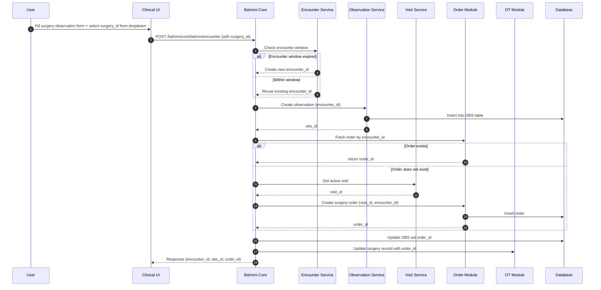
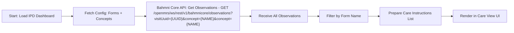
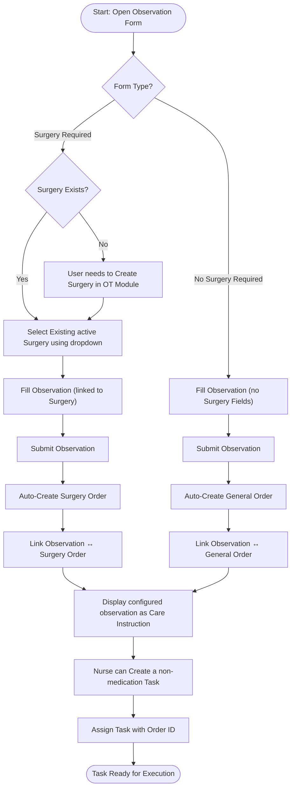

**Nurse Acknowledgment of Physician Instructions**

## **1\. Overview of the Feature**

**Feature Goal:** Establish a formal workflow for nurses to acknowledge physicians to ensure proper communication, execution, accountability, and patient safety.

**Development start date:** March 1st

## **2\. Problem Statement**

**The Current Pain Point:** Physicians issue instructions across multiple forms, such as Admission Orders, Operative Reports, and Progress Notes. Currently, there is no standardized method for nurses to formally acknowledge that they have seen and understood these directives. This leads to a lack of accountability, difficulty in tracking execution status, and potential patient safety risks due to missed or misunderstood instructions.

**Current State:**

* **Fragmented Display:** Physician instructions are scattered across different forms (e.g., Admission Order Form, Orthopaedic Operative Report) and mixed with general notes.  
* **Lack of Workflow:** There is no mechanism to confirm an instruction has been reviewed or acted upon.  
* **No Central Visibility:** Nurses struggle to prioritize instructions effectively as they are not consolidated in a single view.  
* **Missing Alerts:** No alert mechanism exists to notify the care team of new or modified orders.

## **3\. Feature Scope and Requirements**

3.1. Functional Requirements

**Instructions in Care view** We will consolidates the list of instructions for each patient extracted from different forms and display in the IPD care view

* Display distinct line items for each instruction/order.

**Acknowledgment Action (‘Acknowledge’)**

* **Action:** When a provider clicks the ‘Acknowledge’ button, the system will mark the instruction as acknowledged and redirect the user to the IPD Patient Dashboard by focusing on Care Instructions list. Further users can create a non medication task by using contextual actions. 

**Task Creation and Assignment**

* Upon clicking on ‘Schedule action’, the system will allow creation of **non-medication tasks** in the IPD (In-Patient Department) dashboard.

**Integration with IPD Dashboard**

* **Task Management:** The IPD dashboard will list the non-medication tasks, allowing the provider to track execution or re-assign the task if necessary.

**Status Visibility & Care View**

* **Sync:** The status of the task must be reflected in both the IPD dashboard and the Instructions Display Control on the Patient Dashboard.  
* **Care View:** Unacknowledged instructions must be highlighted in the Care View to ensure visibility before they are missed.

## **4\. UI Mockups**

Figma Link: [https://www.figma.com/proto/WGcfleoLBP0SQWSljoVveu/Working-File?node-id=721-21676\&p=f\&t=OWU6d6X1XmuY0z6a-0\&scaling=min-zoom\&content-scaling=fixed\&starting-point-node-id=1020%3A21215\&show-proto-sidebar=1](https://www.figma.com/proto/WGcfleoLBP0SQWSljoVveu/Working-File?node-id=721-21676&p=f&t=OWU6d6X1XmuY0z6a-0&scaling=min-zoom&content-scaling=fixed&starting-point-node-id=1020%3A21215&show-proto-sidebar=1)

## **5\. Sequence Diagrams**

### **5.1 Flow: Instruction Creation through observation page**

### **5.2 Flow: Display Care instructions on IPD dashboard**

### **5.3 Flow: Display Care instructions on IPD care view**

**See:** [105551_discovery_and_plan.md](./105551_discovery_and_plan.md)

### **5.4 Flow: Add Non-medication task on care instruction listed in IPD dashboard**

For detailed information about the Task API, including:
- TaskRequest DTO structure
- Current implementation details
- Gap analysis for linking to care instructions (orderId)
- Backend and frontend changes required

**See:** [tasks_api_discovery.md](./tasks_api_discovery.md)

### **5.5 Flow: Create Order from Observation Form**

This flow demonstrates how observations are automatically linked to orders (either surgery orders or general orders) and how these can be tracked as care instructions and assigned to nurses as executable tasks.

### **5.6 Care Instructions Lifecycle**

**See:** [flowDiagram/careInstructionsLifecycle.mmd](./flowDiagram/careInstructionsLifecycle.mmd)

This diagram shows the complete lifecycle of care instructions from creation through task execution, including:
- Initial instruction display in "Not Acknowledged" tab
- Task creation and acknowledgment workflow
- Handling of updated observations with visual indicators
- Optional nurse actions on instruction updates
